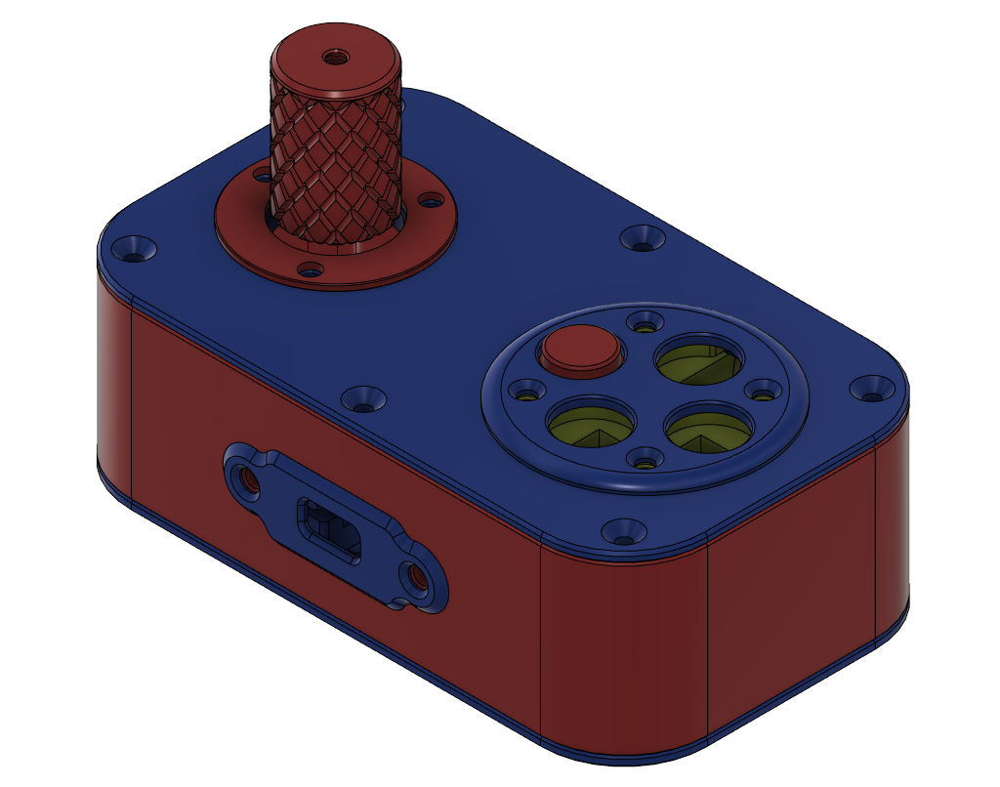
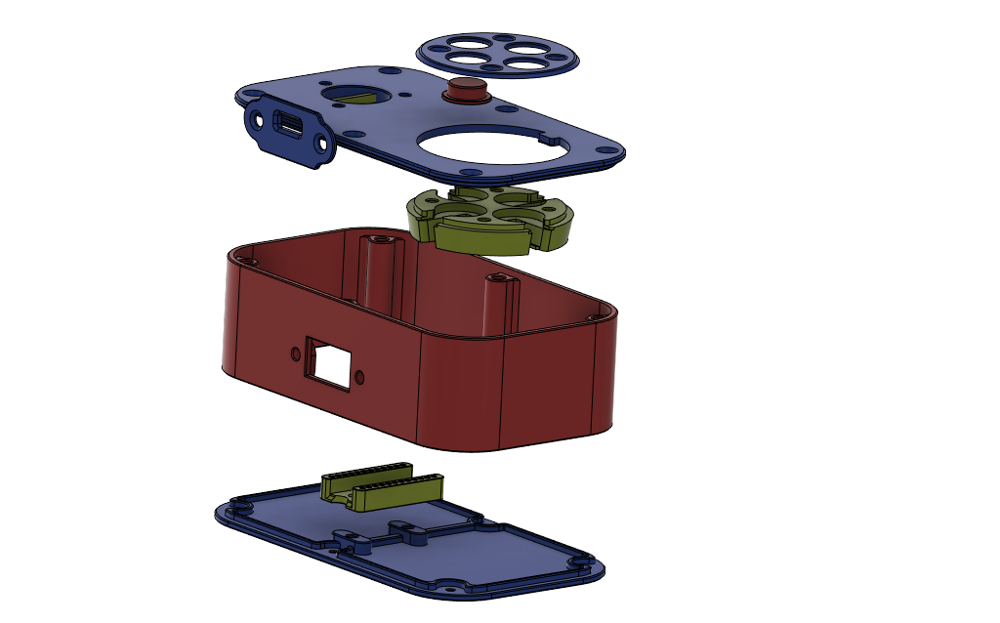

# Spinner Control Case

A case for a spinner control for retro arcade games.

The case lid can be flipped for right handed or left handed spinner operation. The button assembly uses micro switches taken from an old mouse.

All parts were printed with a 0.4 mm nozzle. All holes were sized for threaded inserts for M3 and M2.5 screws. STEP files are provided if you need to make adjustments.

I've included a fit test model for the microswitch slots that can be printed before printing the full microswitch carrier. You want the switch to fit snugly, but bear in mind that if it the fit is really tight then it's going to force the sides of the slot outward making the adjacent slots even tighter.

The optical encoder I used does not tolerate less that 5v input. My arduino was supplying a bit under 5v and I was testing using the full length leads to the encoder. When testing without the boost converter the encoder did not work. My converter output is set to 8v.

## Firmware

The firmware running on the spinner is based on [Wilfried JEANNIARD's repo](https://github.com/willoucom/Arduino_ArcadeSpinner). While holding down button 1 press button 4 then release both buttons. There will be a 1 second delay and then scroll mode will be toggled. While in scroll mode the spinner will send `DPAD UP` presses to the host when turned clockwise and `DPAD DOWN` presses when turned counter-clockwise. While holding button 4 the spinner will send `DPAD RIGHT` and `DPAD LEFT`.

To configure the spinner in the MiSTer UI do the following:

* Toggle scroling mode on
* Using a keyboard, enter the `define joystick buttons` function
* Hold button 4 on the spinner when asked to press `RIGHT` and turn the spinner CW
* When asked to press `DOWN`, release button 4 and turn the spinner counter-clockwise
* Skip the 2 tilt tests
* Hold button 4 and turn the spinner CW then CCW to define `RIGHT` AND `LEFT`
* Release button 4 then turn the spinner CCW then CW to define `UP` and `DOWN`
* Toggle scrolling mode off
* Press and release buttons 1-4 to define `A`, `B`, `X`, and `Y`
* Press enter on the keyboard to save the configuration

If you mess up during these steps press escape and try again.

## Links for parts I purchased for this project

* [Optical encoder](https://www.amazon.com/dp/B07MX1SYXB?ref=ppx_yo2ov_dt_b_product_details&th=1)
* [A less expensive optical encoder which should also work](https://www.amazon.com/dp/B00UTIFCVA/?coliid=I373P7F62KK8D2&colid=1G7PXZNDFR96N&psc=1&ref_=list_c_wl_lv_ov_lig_dp_it)
* [Boost converter](https://www.amazon.com/dp/B0C858YYQ1?ref=ppx_yo2ov_dt_b_product_details&th=1)
* [Type-C USB Pro Micro ATmega32U4 5V 16MHz](https://www.amazon.com/dp/B0BCW67NJP?psc=1&ref=ppx_yo2ov_dt_b_product_details)

---

---

---

